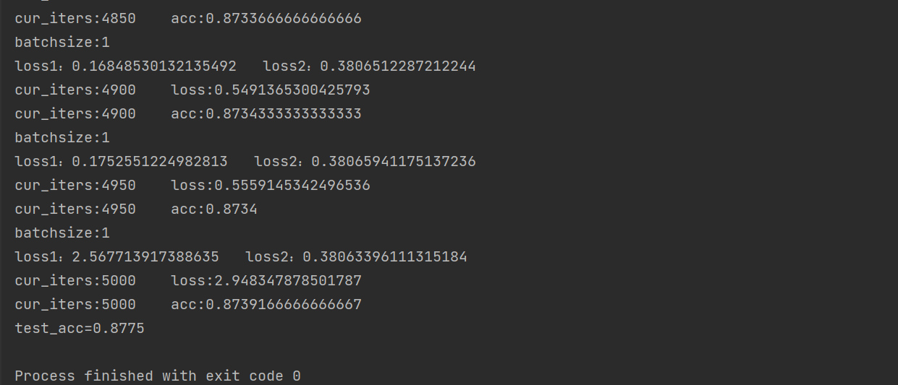

# 基于numpy的两层神经网络模型


## 数据集


本神经网络模型使用MNIST数据集：

[MNIST handwritten digit database, Yann LeCun, Corinna Cortes and Chris Burges](http://yann.lecun.com/exdb/mnist/)


下载好的数据集被解压保存在`./MNIST/`目录下，所有对于数据集的预处理将在`ReadMNIST.py`文件中完成.


**由于github限制了上传的文件大小，上传文件时将数据集压缩成了rar文件，同时由于python展开rar依赖库配置十分麻烦，还请手动解压缩！**


### 归一化和标准化


归一化:

将所有的像素值缩放至[0,1]区间内.


标准化:

将每一组测试数据变成均值为0,方差为1的向量.

```
def standardization(data):
    mu = np.mean(data, axis=1).reshape(data.shape[0],1)
    sigma = np.std(data, axis=1).reshape(data.shape[0],1)
    return (data - mu) / sigma
```

归一化和标准化的目的都是为了加快模型训练速度.


## 超参数

本模型的超参数如下所示:

```
lrate = 0.01 #学习率
layer_size1 = 20 #中间层神经元个数
lam = 0.1 #L2正则化强度
beta = 0.96 #指数衰减下降参数
```


## 反向传播算法


运用链式法则思想,逆向更新参数的导数,并使用梯度下降法更新参数值.


```
def back_propagation(x, y, yhat, a_1,W_1,W_2,N,lam):
    assert (y.shape == yhat.shape)
    """后向传播"""
    dZ_2 = (1 / N) * (yhat - y)
    # print('dZ_2.shape:'+str(dZ_2.shape))
    dW_2 = np.dot(dZ_2, a_1.T) + lam * W_2#(10*16)
    db_2 = dZ_2.sum(axis=1, keepdims=True)
    dZ_1 = np.dot(W_2.T, dZ_2) * (a_1 > 0)#(16*60000)
    dW_1 = np.dot(dZ_1, x.T) + lam * W_1#(16*60000)*(60000*784)
    db_1 = dZ_1.sum(axis=1, keepdims=True)
    grads = {'dw2': dW_2,
             'db2': db_2,
             'dw1': dW_1,
             'db1': db_1}
    return grads
```


```
def optimizeGD(W_1,W_2,b_1,b_2,lr,grads):
    """梯度下降方法"""
    W_1 = W_1 - lr * grads['dw1']
    W_2 = W_2 - lr * grads['dw2']
    b_1 = b_1 - lr * grads['db1']
    b_2 = b_2 - lr * grads['db2']

    return W_1,W_2,b_1,b_2
```


## L2正则化


l2正则化避免出现过拟合的情况.


在loss函数中增加正则化因子:

```
loss2 = 1/2 * lam * (np.sum(np.square(W_2)) + np.sum(np.square(W_1)))
```


同时在进行反向传播计算时,对W_1,W_2添加对应的偏置量:

```
dW_2 = np.dot(dZ_2, a_1.T) + lam * W_2
```

```
dW_1 = np.dot(dZ_1, x.T) + lam * W_1
```


## 激活函数和loss函数


采用Relu函数作为此网络模型的第一层,softmax作为网络模型的第二层,同时,以交叉熵损失函数作为本模型的loss函数.


Relu:

```
def Relu(x):
    return np.maximum(0,x)
```


Softmax:

```
def softmax(x):
    return np.exp(x) / np.sum(np.exp(x), axis=0)
```


Cross_entropy_error:

```
def cross_entropy_error(yhat, y, batch_size, W_1, W_2, lam):
    assert(y.shape == yhat.shape)
    print('batchsize:'+str(batch_size))
    loss1 = (-1/batch_size)*np.sum((y*np.log(yhat) + (1-y)*np.log(1-yhat)))
    loss2 = 1/2 * lam * (np.sum(np.square(W_2)) + np.sum(np.square(W_1)))
    print('loss1：'+str(loss1)+'   ''loss2：'+str(loss2))
    return loss1 + loss2
```


其中,loss1是交叉熵损失,loss2是参数的正则化损失.


## 优化器SGD


每一次迭代时使用训练集的随机一个数据进行梯度计算以及参数更新,

```
x = np.random.randint(train_data.shape[1])
SGDdata = train_data[:,x].reshape(784,1)
SGDlabels = train_labels[:,x].reshape(10,1)
```


```
# 后向传播计算梯度
grads = back_propagation(SGDdata, SGDlabels, yhat, a_1, W_1,W_2, SGDdata.shape[1],lam)
# 更新参数
W_1, W_2, b_1, b_2 = optimizeGD(W_1, W_2, b_1, b_2, Exponential_Decay(lrate, i//50, beta=0.96), grads)
```


SGD极大的提高的模型的训练速度,但是降低了本模型的训练精度,由于本模型在使用传统的梯度下降时只需要循环200次即可达到90%的精确度,但是随机梯度下降算法更适用于训练数据集更为庞大的情况.


## 学习率下降策略


采用指数衰减下降策略

```
def Exponential_Decay(lr, i, beta=0.96):
    return lr * pow(beta, i)
```


在未指定下降策略和指定指数下降策略的情况下loss和准确率的变化如下:


指数下降:


未使用(lrate = 0.1):

.png)


## 训练结果


在使用SGD梯度下降策略(等价于minibatch中batchsize = 1的方法)进行迭代5000次后,模型训练集准确率稳定在0.8734,同时测试集的准确率为0.8775.





## 参数保存以及使用模型


训练模型被保存在`W_1.csv`,`W_2.csv`,`b_1.csv`,`b_2.csv`四个CSV文件中，运行predict.py可以查看所有测试集的准确率。